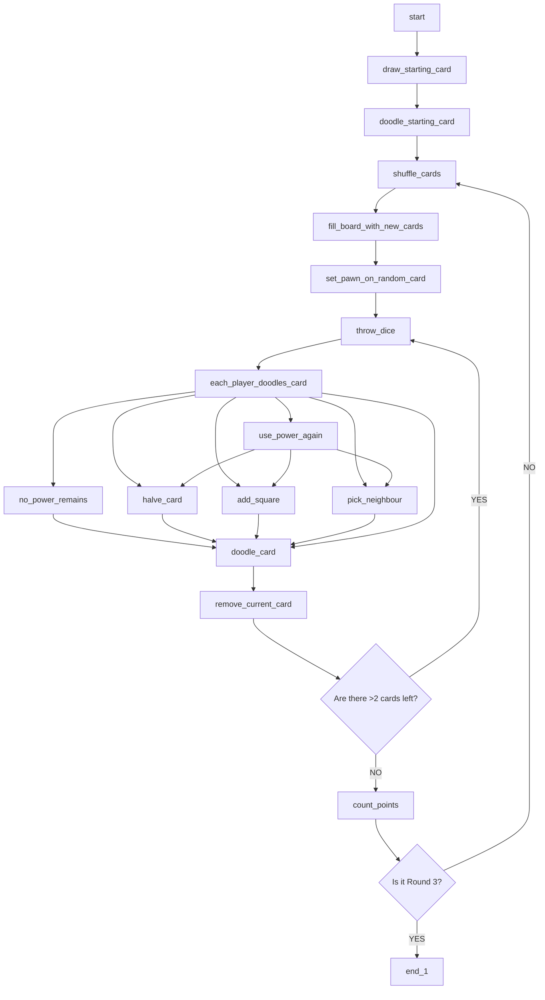

# Notes

## Flowchart of patchwork doodle

```mermaid
graph TD;
    start-->draw_starting_card
    draw_starting_card-->doodle_starting_card
    doodle_starting_card-->shuffle_cards
    shuffle_cards-->fill_board_with_new_cards
    fill_board_with_new_cards-->set_pawn_on_random_card
    set_pawn_on_random_card-->throw_dice
    throw_dice-->each_player_doodles_card
    
    each_player_doodles_card-->no_power_remains
    each_player_doodles_card-->pick_neighbour
    each_player_doodles_card-->halve_card
    each_player_doodles_card-->add_square
    each_player_doodles_card-->use_power_again

    use_power_again-->add_square
    use_power_again-->halve_card
    use_power_again-->pick_neighbour

    no_power_remains-->doodle_card
    halve_card-->doodle_card
    add_square-->doodle_card
    pick_neighbour-->doodle_card
    each_player_doodles_card-->doodle_card
    
    doodle_card-->remove_current_card
    remove_current_card-->B

    B{Are there >2 cards left?}
    B-->|YES|throw_dice
    B-->|NO|count_points
    
    count_points-->C

    C{Is it Round 3?}
    C-->|YES|end_1
    C-->|NO|shuffle_cards

    end_1
```
